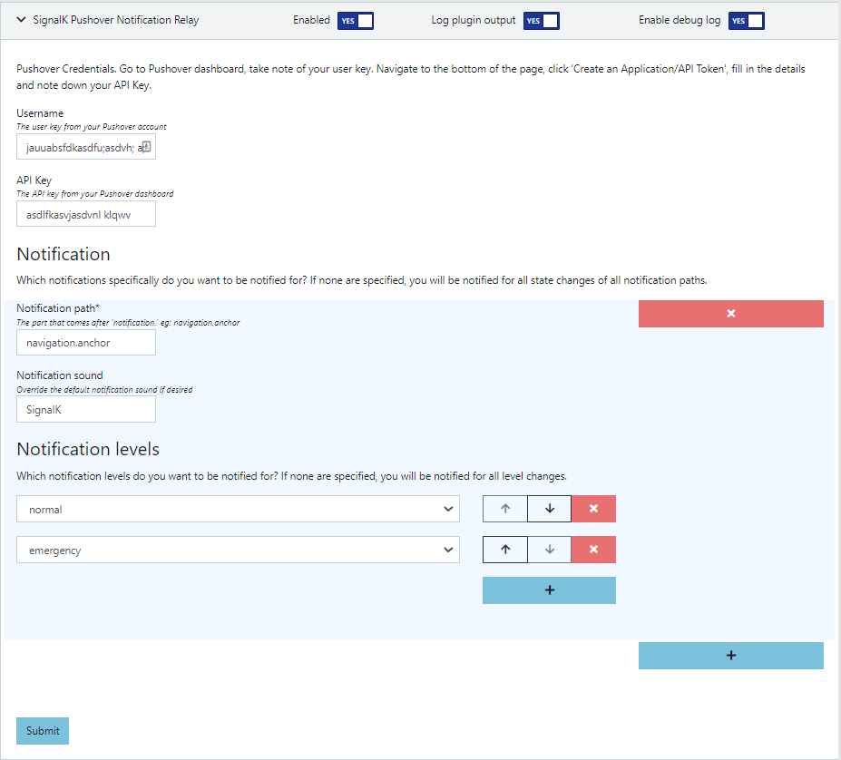

# signalk-pushover-notification-relay

Signalk-node-server plugin that pushes listens for change of state in SignalK notifications and sends the updates via push message gateway Pushover (https://pushover.net/). Particularly useful to keep an eye on your boat when you are not aboard. The author created this plugin to enable remote notification of anchor dragging emergencies.

# About Pushover

Pushover (no affiliation with the author or this software) makes it easy to get real-time notifications on your Android, iPhone, iPad, and Desktop (Android Wear and Apple Watch, too!).
This plugin uses it to forward your notifications to your mobile phone via push message.
Pushover is a commercial service and you will need to pay a fee. You can get started for free however, you will be given a trial period for testing when you sign up.

# Installation

First you'll  want to make sure you have the latest and greatest [signalk-server-node](https://github.com/SignalK/signalk-server-node) installed. Please see instructions there for initial install.
Next install the node server plugins that you want. Go to <http://localhost:3000/appstore> and install:

signalk-pushover-notification-relay

# Configuration

Go to your Pushover dashboard and note down your User Key. Navigate to the bottom of the page and create and API Key, note it down.

Navigate to http://localhost:3000/admin/#/serverConfiguration/plugins/signalk-pushover-notification-relay, and enter your Pushover user key and API key.

You can leave the Notifications section empty if you want a notification for all notification.* paths and all states. Ideally, you should configure which notification paths you are interested in and which levels... For example notifications.navigation.anchor normal and emergency.

You can also override the default sound if you wish.

That's it.
